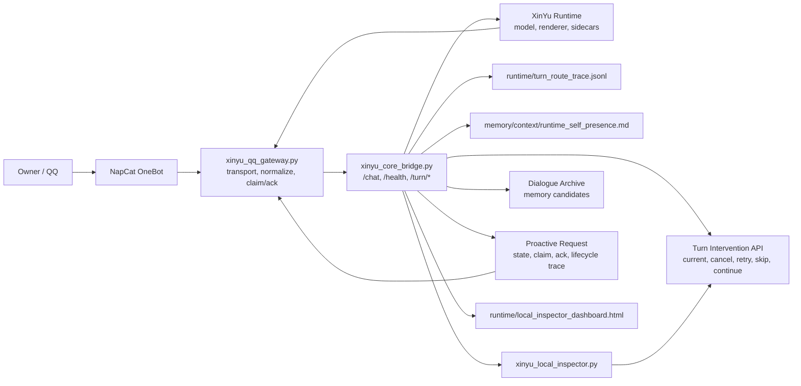

# XinYu Architecture

This diagram reflects the post-intervention API architecture.

## Boundaries

- QQ gateway is transport only.
- Core bridge owns route decisions, memory sidecars, expression guards, proactive policy, and intervention state.
- Stable memory writes are gated; runtime observations first become candidates or traces.
- The inspector and dashboard expose sanitized operator facts, not raw private chat.

## Main Runtime Paths

- Live chat: `/chat`
- Health: `/health`
- Turn inspection: `/turn/current`
- Turn recovery: `/turn/cancel`, `/turn/retry-lightweight`, `/turn/skip-sidecar`, `/turn/continue`, `/turn/status-message`
- Proactive delivery: `/proactive`, `/proactive/ack`, `/qq/outbox/claim`, `/qq/outbox/ack`
- Local inspector: `xinyu_local_inspector.py`

## Cognitive Extension (see kernel/COGNITIVE_ARCHITECTURE.md)

The runtime now has an independent Cognitive Kernel layer:
- kernel/self: Persistent Self + emerging Self Model
- experience/: Importance scoring + proposals that can update Self
- kernel/: Cognitive Kernel (Self, Belief, WM, Reorganization Loop K-008)
- Reorg loop propagates Experience signals into Attention/Goals/memory candidates with owner review.

