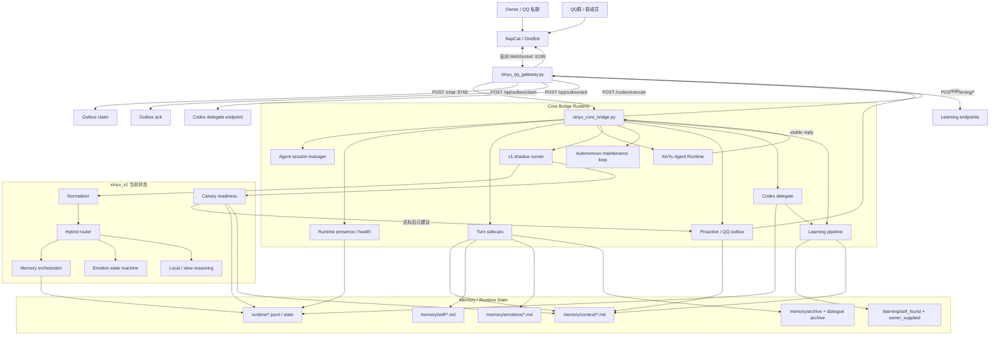
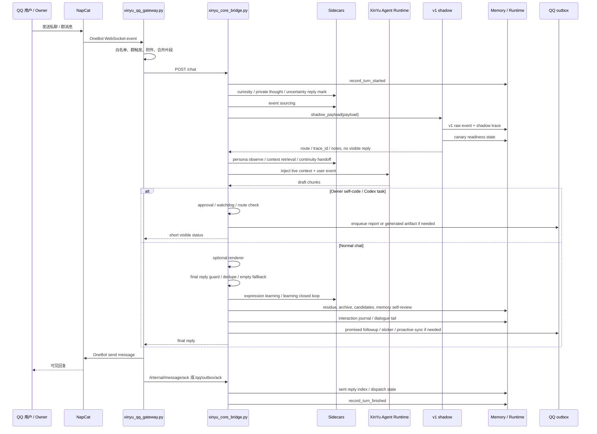
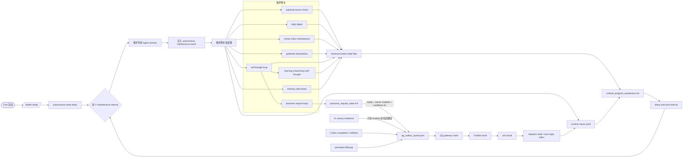

# XinYu System Diagrams

这份图是给当前 XinYu 本地运行态看的：核心运行链路是 NapCat QQ -> `xinyu_qq_gateway.py` -> `xinyu_core_bridge.py` -> XinYu Agent Runtime。v1 已接入 shadow/canary 观察，但还不是主回复路径。

## 1. 整体架构图

## 2. 单轮消息流程图

## 3. 后台运转图

## 当前主边界

- `xinyu_core_bridge.py` 仍是主控制面：聊天、学习、Codex、主动发送、健康检查都从这里汇合。
- `xinyu_qq_gateway.py` 是当前 QQ 适配层；AstrBot 不在当前链路里。
- v1 现在是 shadow/canary：记录路线、观察错误率、达标后给 owner 发建议，但不自动切全量。
- 稳定记忆写入不是模型直接改文件，而是经由 event sourcing、archive、candidate extraction、memory self-review 等门控侧车。
- 主动联系不直接发送：先生成 request/outbox，再由 gateway claim/ack，避免无状态乱发。
